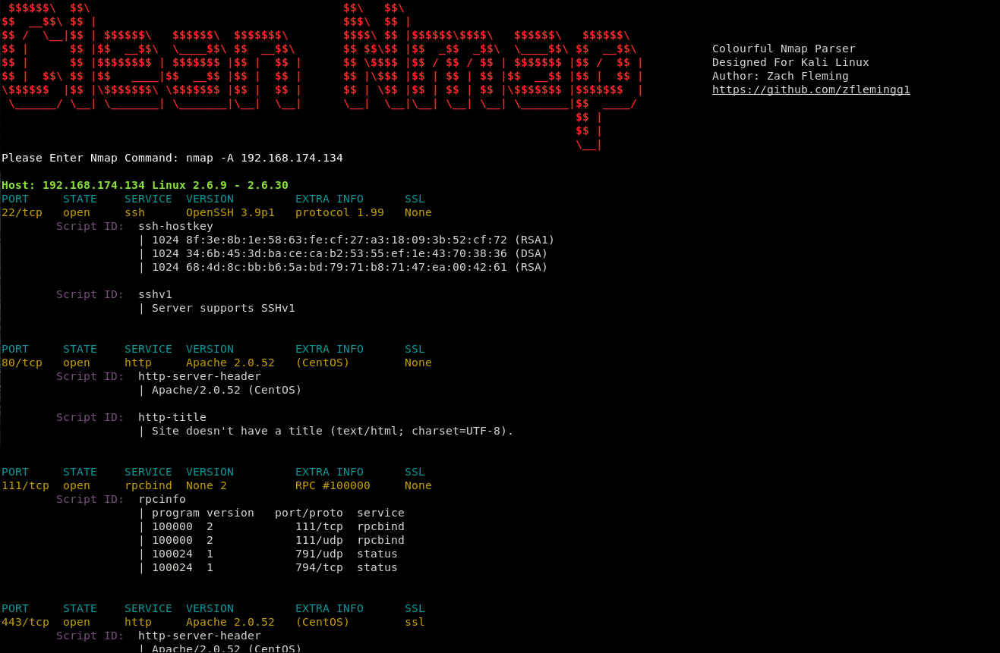
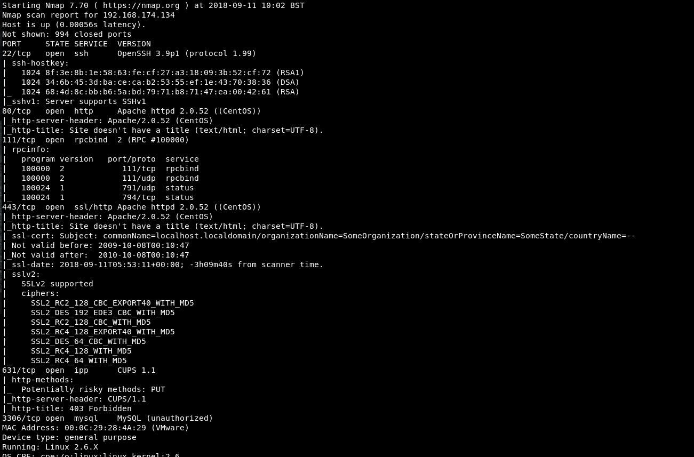

# Colourful Nmap
Tool used to simplify and colour code nmap output so that it is easier to read.

### Basic Info
Tool used to simplify and colour code nmap output so that it is easier to read. When it is run, it will load the simplified nmap output in the current terminal window, and it will also open a new terminal tab and display the original nmap output in that if there is additional info needed.

### Setup
To set up the tool simply clone it i.e. git clone. Navigate into that directory and then enter  pip install -r requirements.txt into the command line. This will install the required python modules if not already installed on your system.

### Launching The Program
To use the program simply open up a terminal navigate to the directory and run it with "python 'nmap_parser.py'"

### Running The Program

Example of Simplified Colour Coded Output

Example of Original Output In Second Terminal

### Built With

* Python 2.7.14

### Authors

*** Zach Fleming --> zflemingg1@gmail.com

